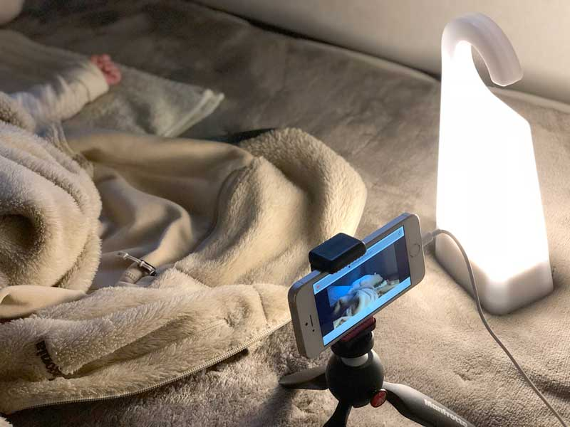
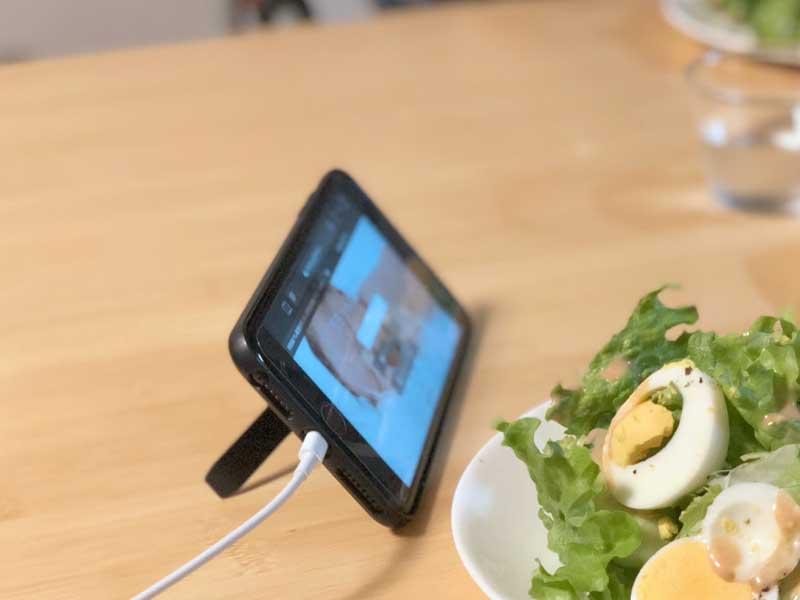

# これは何？
{: .my-5 }

赤ちゃんの様子を見守るアプリです。
赤ちゃんが寝ている間に、別室で家事をするときなどに便利です。
もちろん、ペットの見守り、留守宅の監視など、他の用途にも利用できます。
スマホやパソコンを2台以上用意し、1台をカメラとして、残りはモニターとして使います。

メリットは、使わなくなったスマホを、カメラとして**リユース**できることです。
使わなくなったスマホが家で眠っている方におススメです。

このアプリを作った理由は、子供が生まれたことと、[SkyWay](https://webrtc.ecl.ntt.com/){: target="_blank" }というアプリ開発者向けサービスの良さを広めるためです。
SkyWay(のCommunity Editionという無償プラン)のおかげで、短期間に開発し、無料で提供することができました。

# 使いかたは2ステップ
{: .my-5 }

1. カメラとして使いたいスマホ or パソコンでこのページを開き、合言葉を入力し、「 カメラとして使う」をタップします。
2. モニターとして使いたいスマホ or パソコンでこのページを開き、1で決めた合言葉を入力し、「 モニターとして使う」をタップします。

終了するときは「 終了」をタップします。

合言葉が一致すれば、誰でもカメラの映像を見ることができます。
「名前だけ」「誕生日だけ」「数字だけ」などは避け、推測されにくい合言葉を考えましょう。

1台のカメラに対して、2台以上でモニターすることもできます。
モニターの台数が増えると、カメラの動作が遅くなります。
モニターできる台数は、カメラの性能によって変わります。

# より便利な使いかた
{: .my-5 }

{: .img-fluid .mb-1 style="width: 400px;" }
{: .img-fluid .mb-1 style="width: 400px;" } 

電池の消耗が激しいので、電源アダプタに接続したまま利用することをお勧めします。
コンセントから離れている場所で使う場合は、USB延長ケーブルが便利です。
スマホ用三脚を使うと、カメラの向きを自由に変えられます。
充電式LEDライトがあると、夜でも赤ちゃんの表情が確認できます。

- [Manfrotto ミニ三脚 PIXI Smart](https://www.amazon.co.jp/dp/B0169SORBO/){: target="blank" }
- [無印良品 LED持ち運びできるあかり](https://lohaco.jp/product/9741156/){: target="blank" }
- [iBUFFALO USB2.0延長ケーブル ホワイト 3m](https://www.amazon.co.jp/dp/B007STDM2O/){: target="blank" }

台所などでモニターする場合は、スタンドになるもスマホケースが便利です。

- [TOPEAK ライドケース](https://www.amazon.co.jp/dp/B06XCQBVYY/){: target="blank" }

# 注意していただきたいこと
{: .my-5 }

iPhoneをカメラとして使った場合に、時々、音が送られないことがあります。
Safariを強制終了してすると直ります。([Apple公式サイトの手順](https://support.apple.com/ja-jp/HT201330))    
モニターを始めた時に、モニター側に音が届いていることを必ず確認してください。
モニター側のアドレスバー(Safari)またはタブ(Chrome、Firefox)の、スピーカーのマークが目印です。
今のところ、使っている途中で音を送らなくなることはないようです。

電磁波の身体への影響を心配される方に、参考までにお伝えします。
私は、機内モードに設定した上でWi-FiのみをONにし、赤ちゃんから十分に離れたところに置くようにしています。
Wi-Fiの電磁波の強さは4Gの**20分の1**です。
また、1m離すと、10cmと比べて、電磁波が**1000分の1**になります。

データ通信料にご注意ください。
2台とも同じWi-Fiルータに接続していれば、携帯電話会社のパケットを消費しないので、通信量を節約できます。

自宅だけではなく、屋外や職場などからも、モニターすることができます。
ただし、ネットワークの種類によってはつながらないことがあります。
特に、大企業や大学のネットワーク内からは、利用できない可能性が高いです。
そういった環境で利用したい方は、[高度な使い方](#advanced)をお読みください。

# 対応環境
{: .my-5 }

スマホ・タブレット(iPhone, iPad, Android)、パソコン(Windows, Mac)の、ブラウザ(Safari、Chrome、Firefox)で利用できます。

- iPhone (iPhone 5s以降), iPad (iPad 第5世代以降、iPad mini 2以降)
    - iOS 11.2.6以上
- Android (一部の機種は非対応なようです)
    - Chrome 最新版とその1つ前のバージョン
    - Firefox 最新版とその1つ前のバージョン
- Windows
    - Chrome 最新版とその1つ前のバージョン
    - Firefox 最新版とその1つ前のバージョン
- Mac
    - Safari 11.0.3以上 (macOS High Sierra以上)
    - Chrome 最新版とその1つ前のバージョン
    - Firefox 最新版とその1つ前のバージョン

# 専用機や専用アプリの紹介
{: .my-5 }

使い勝手や機能面では、専用機や専用アプリにはかないません。
このアプリが物足りなく感じる方は、試してみてください。
iPhone用アプリには、次のようなものがあるようです。

- [ベビーモニター 3G](https://itunes.apple.com/jp/app/id490077681?mt=8){: target="blank" }
- [Cloud Baby Monitor](https://itunes.apple.com/jp/app/id432791399?mt=8){: target="blank" }
- [Baby Monitor for iPhone](https://itunes.apple.com/jp/app/id882770893?mt=8){: target="blank" }
- [ベビーモニター：万能なビデオ監視](https://itunes.apple.com/jp/app/id735272656?mt=8){: target="blank" }

# 高度な使いかた
{: .my-5 id="advanced" }

以降は開発者向けの説明です。

ソースコードを[GitHub](https://github.com/rotsuya/skyway-baby-monitor/){: target="blank" }で公開しています。
自由に改変・設置することができます。

大企業や大学のネットワーク内から利用するためには、TURNサーバが必要な場合があります。
TURNサーバを利用するためには、ご自身でこのプログラムをサーバに設置し、SkyWayのアプリケーションの設定で「TURNを利用する」を有効にしてください。
詳しくは、[README](https://github.com/rotsuya/skyway-baby-monitor/){: target="blank" }をご覧ください。
